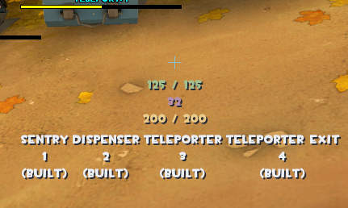

# LuaHUD

# How to use

Linux: put it in your TF2's Proton prefix/AppData/Local
 Default path (if you installed TF2 in the default storage) is `~/.steam/steam/steamapps/compatdata/440/pfx/drive_c/users/steamuser/AppData/Local`

Windows: put it in %localappdata%

# How to build

Requirements:

- Luabundler
- A Linux shell (Bash, ZSH, Fish, ...)

How to build: `./build.sh`

## Previews

generic (most weapons)

---

engineer

---

sniper

---

spy

---

demoman
